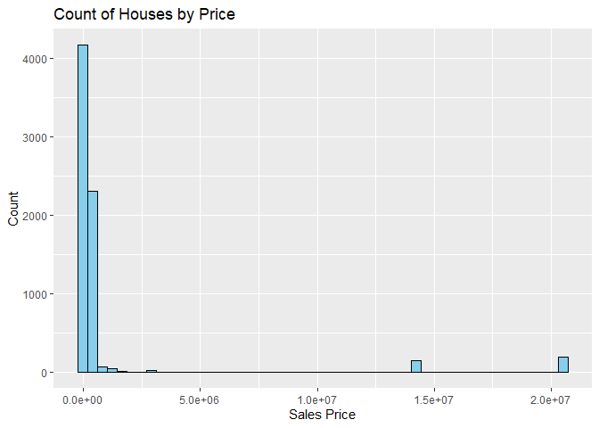
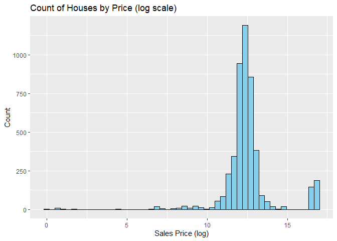
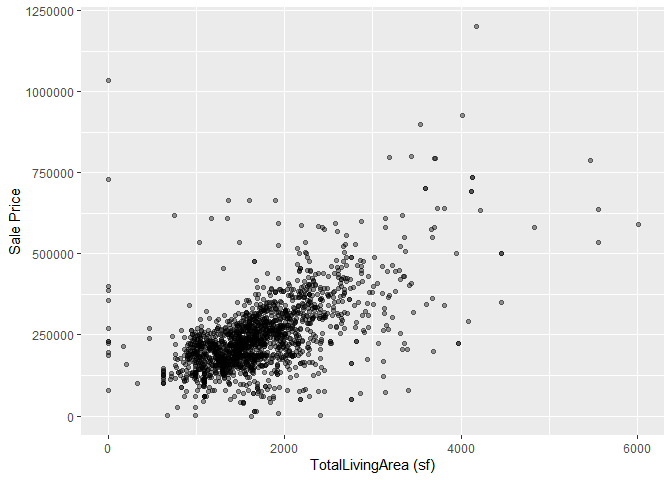
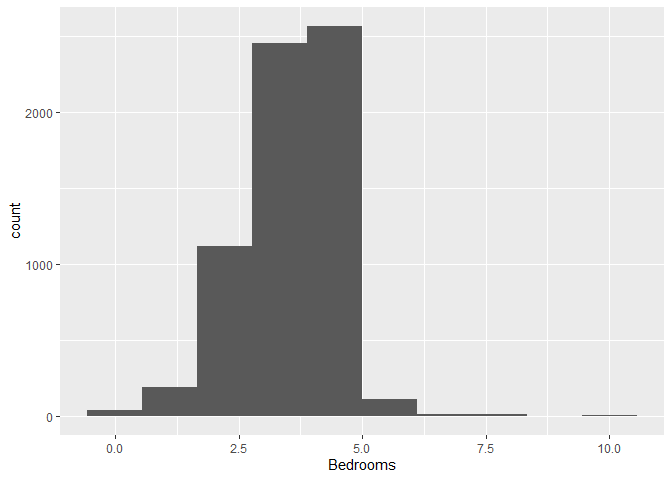

<!-- README.md is generated from README.Rmd. Please edit the README.Rmd file -->

# Lab report \#1

Follow the instructions posted at
<https://ds202-at-isu.github.io/labs.html> for the lab assignment. The
work is meant to be finished during the lab time, but you have time
until Monday evening to polish things.

Include your answers in this document (Rmd file). Make sure that it
knits properly (into the md file). Upload both the Rmd and the md file
to your repository.

All submissions to the github repo will be automatically uploaded for
grading once the due date is passed. Submit a link to your repository on
Canvas (only one submission per team) to signal to the instructors that
you are done with your submission.

# Step 1 Result

``` r
library(classdata)
library(tidyverse)
```

    ## ── Attaching core tidyverse packages ──────────────────────── tidyverse 2.0.0 ──
    ## ✔ dplyr     1.1.4     ✔ readr     2.1.5
    ## ✔ forcats   1.0.0     ✔ stringr   1.5.1
    ## ✔ ggplot2   3.5.2     ✔ tibble    3.3.0
    ## ✔ lubridate 1.9.4     ✔ tidyr     1.3.1
    ## ✔ purrr     1.1.0     
    ## ── Conflicts ────────────────────────────────────────── tidyverse_conflicts() ──
    ## ✖ dplyr::filter() masks stats::filter()
    ## ✖ dplyr::lag()    masks stats::lag()
    ## ℹ Use the conflicted package (<http://conflicted.r-lib.org/>) to force all conflicts to become errors

``` r
head(ames)
```

    ## # A tibble: 6 × 16
    ##   `Parcel ID` Address      Style Occupancy `Sale Date` `Sale Price` `Multi Sale`
    ##   <chr>       <chr>        <fct> <fct>     <date>             <dbl> <chr>       
    ## 1 0903202160  1024 RIDGEW… 1 1/… Single-F… 2022-08-12        181900 <NA>        
    ## 2 0907428215  4503 TWAIN … 1 St… Condomin… 2022-08-04        127100 <NA>        
    ## 3 0909428070  2030 MCCART… 1 St… Single-F… 2022-08-15             0 <NA>        
    ## 4 0923203160  3404 EMERAL… 1 St… Townhouse 2022-08-09        245000 <NA>        
    ## 5 0520440010  4507 EVERES… <NA>  <NA>      2022-08-03        449664 <NA>        
    ## 6 0907275030  4512 HEMING… 2 St… Single-F… 2022-08-16        368000 <NA>        
    ## # ℹ 9 more variables: YearBuilt <dbl>, Acres <dbl>,
    ## #   `TotalLivingArea (sf)` <dbl>, Bedrooms <dbl>,
    ## #   `FinishedBsmtArea (sf)` <dbl>, `LotArea(sf)` <dbl>, AC <chr>,
    ## #   FirePlace <chr>, Neighborhood <fct>

``` r
str(ames)
```

    ## tibble [6,935 × 16] (S3: tbl_df/tbl/data.frame)
    ##  $ Parcel ID            : chr [1:6935] "0903202160" "0907428215" "0909428070" "0923203160" ...
    ##  $ Address              : chr [1:6935] "1024 RIDGEWOOD AVE, AMES" "4503 TWAIN CIR UNIT 105, AMES" "2030 MCCARTHY RD, AMES" "3404 EMERALD DR, AMES" ...
    ##  $ Style                : Factor w/ 12 levels "1 1/2 Story Brick",..: 2 5 5 5 NA 9 5 5 5 5 ...
    ##  $ Occupancy            : Factor w/ 5 levels "Condominium",..: 2 1 2 3 NA 2 2 1 2 2 ...
    ##  $ Sale Date            : Date[1:6935], format: "2022-08-12" "2022-08-04" ...
    ##  $ Sale Price           : num [1:6935] 181900 127100 0 245000 449664 ...
    ##  $ Multi Sale           : chr [1:6935] NA NA NA NA ...
    ##  $ YearBuilt            : num [1:6935] 1940 2006 1951 1997 NA ...
    ##  $ Acres                : num [1:6935] 0.109 0.027 0.321 0.103 0.287 0.494 0.172 0.023 0.285 0.172 ...
    ##  $ TotalLivingArea (sf) : num [1:6935] 1030 771 1456 1289 NA ...
    ##  $ Bedrooms             : num [1:6935] 2 1 3 4 NA 4 5 1 3 4 ...
    ##  $ FinishedBsmtArea (sf): num [1:6935] NA NA 1261 890 NA ...
    ##  $ LotArea(sf)          : num [1:6935] 4740 1181 14000 4500 12493 ...
    ##  $ AC                   : chr [1:6935] "Yes" "Yes" "Yes" "Yes" ...
    ##  $ FirePlace            : chr [1:6935] "Yes" "No" "No" "No" ...
    ##  $ Neighborhood         : Factor w/ 42 levels "(0) None","(13) Apts: Campus",..: 15 40 19 18 6 24 14 40 13 23 ...

``` r
summary(ames)
```

    ##   Parcel ID           Address                        Style     
    ##  Length:6935        Length:6935        1 Story Frame    :3732  
    ##  Class :character   Class :character   2 Story Frame    :1456  
    ##  Mode  :character   Mode  :character   1 1/2 Story Frame: 711  
    ##                                        Split Level Frame: 215  
    ##                                        Split Foyer Frame: 156  
    ##                                        (Other)          : 218  
    ##                                        NA's             : 447  
    ##                           Occupancy      Sale Date            Sale Price      
    ##  Condominium                   : 711   Min.   :2017-07-03   Min.   :       0  
    ##  Single-Family / Owner Occupied:4711   1st Qu.:2019-03-27   1st Qu.:       0  
    ##  Townhouse                     : 745   Median :2020-09-22   Median :  170900  
    ##  Two-Family Conversion         : 139   Mean   :2020-06-14   Mean   : 1017479  
    ##  Two-Family Duplex             : 182   3rd Qu.:2021-10-14   3rd Qu.:  280000  
    ##  NA's                          : 447   Max.   :2022-08-31   Max.   :20500000  
    ##                                                                               
    ##   Multi Sale          YearBuilt        Acres         TotalLivingArea (sf)
    ##  Length:6935        Min.   :   0   Min.   : 0.0000   Min.   :   0        
    ##  Class :character   1st Qu.:1956   1st Qu.: 0.1502   1st Qu.:1095        
    ##  Mode  :character   Median :1978   Median : 0.2200   Median :1460        
    ##                     Mean   :1976   Mean   : 0.2631   Mean   :1507        
    ##                     3rd Qu.:2002   3rd Qu.: 0.2770   3rd Qu.:1792        
    ##                     Max.   :2022   Max.   :12.0120   Max.   :6007        
    ##                     NA's   :447    NA's   :89        NA's   :447         
    ##     Bedrooms      FinishedBsmtArea (sf)  LotArea(sf)          AC           
    ##  Min.   : 0.000   Min.   :  10.0        Min.   :     0   Length:6935       
    ##  1st Qu.: 3.000   1st Qu.: 474.0        1st Qu.:  6553   Class :character  
    ##  Median : 3.000   Median : 727.0        Median :  9575   Mode  :character  
    ##  Mean   : 3.299   Mean   : 776.7        Mean   : 11466                     
    ##  3rd Qu.: 4.000   3rd Qu.:1011.0        3rd Qu.: 12088                     
    ##  Max.   :10.000   Max.   :6496.0        Max.   :523228                     
    ##  NA's   :447      NA's   :2682          NA's   :89                         
    ##   FirePlace                            Neighborhood 
    ##  Length:6935        (27) Res: N Ames         : 854  
    ##  Class :character   (37) Res: College Creek  : 652  
    ##  Mode  :character   (57) Res: Investor Owned : 474  
    ##                     (29) Res: Old Town       : 469  
    ##                     (34) Res: Edwards        : 444  
    ##                     (19) Res: North Ridge Hei: 420  
    ##                     (Other)                  :3622

``` r
?ames
```

    ## starting httpd help server ... done

There are 14 variables in this data set.

There is the house’s “Style”, how the house looks, which is a
categorical factor type of data. In “Style” there are 6 options,
detailing if the house is one or two story and other aspects of its
design. There is an other option as well.

There is “Occupancy” which is the intended use which is categorical
factor data type as well. There are 5 unique values with Condominium,
Single-Family, Townhouse, Two-Family Conversion, and Two-Family Duplex.

There is “Sales Date” which is the date that the house sold and is a
date data type. It ranges from July 3rd, 2017 to August 31st, 2022.

“Sale Price” is the price at which the house is sold in US Dollars and
is a numerical data type. The range is 20.5 million with a minimum house
sale price of 0 (likely never sold the house) and a maximum of
20,500,000. 20,500,000 is an outlier and the interquartile range is
119,100 between 170,900 to 280,000.

“MultiSale” is a logical data type with NA (Not a MultiSale) and Y (Yes
a Multisale) as the two unique values. It measures whether or not a
house was sold in a “package” likely alongside another house.

“YearBuilt” is an integer variable and numerical data type. This
measures the year that the house was built. The years built ranges 66
years between 1956 to 2022. Some have a 0 or are NA. They likely did not
record this data.

“Acres” is a numerical data type and measures the number of acres of the
lot the house is on. The interquartile range is 0.1268 acres between
0.1502 and 0.2770 with a minimum of 0 and a maximum of 12.0120. The
houses with 0 acres are only the buildings and do not include the land
it is attached to.

“Total Living Area” is a numerical data type and the total square
footage of a house’s living area, in other words, the inside of the
house. The interquartile range is 697 square feet between 1095 and 1792
with a minimum of 0 and maximum of 6007. Those houses with 0 sf of total
living area likely do not have any buildings and is just the selling of
an empty plot of land.

“Bedrooms” is a numerical data type showing the number of bedrooms in a
house. It has a range of 10 bedrooms from 0 to 10.

“FinishedBsmtArea” is a numerical data type showing the total square
footage of a house’s basement area. It has a range of 6,486 square feet
from 10 to 6,496. It is important to note that no houses are marked as
zero. Either every house has a basement or those without basements are
marked NA.

“Lot Area” is a numerical data type showing the total square footage of
a house’s entire lot. It has an interquartile range of 5,535 square feet
from 6,553 to 12,088 with a minimum of 0 (same reasoning as for the 0s
in “Acres”) and a maximum of 523,228.

“AC” is a logical data type with “Yes” and “No” meaning a house has AC
or does not respectively.

“FirePlace” is a logical data type with “Yes” and “No” meaning a house
has a Fire Place or does not respectively.

“Neighborhood” is a categorical data type describing the location of the
house in Ames based on the neighborhood it is in. There are about 42
unique values.

# Step 2 Result

Price is the variable of interest since it is the output that we want to
predict or model based on the other factors

# Step 3 Result

Which variable is the main variable?

Price

What is the range of this variable?

``` r
range(ames$`Sale Price`, na.rm = TRUE)
```

    ## [1]        0 20500000

Draw a histogram for a numeric variable or a bar chart, if the variable
is categorical.

``` r
  ggplot(ames, aes(x = `Sale Price`)) +
  geom_histogram(bins = 50, fill = "skyblue", color = "black") +
  labs(x = "Sales Price", y = "Count", title="Count of Houses by Price")
```

<!-- -->

``` r
ames |>
  filter(`Sale Price` != 0) |>
  ggplot(aes(x = log(`Sale Price`))) +
  geom_histogram(bins = 50, fill = "skyblue", color = "black") +
  labs(x = "Sales Price (log)", y = "Count", title="Count of Houses by Price (log scale)")
```

<!-- -->

What is the general pattern?

Extremely right skewed.

Is there anything odd?

High concentration near 0 because many of the houses haven’t been sold.

``` r
sum(ames$`Sale Price` == 0)
```

    ## [1] 2206

# Step 4 Result

Henry:

The variable I chose was Total Living Area, since when filtering out
Condominiums and 1 Story Frames and unsold properties, it correlated
pretty tightly with price.

``` r
ames |>
  filter(`Sale Price` != 0, Style != "1 Story Frame", Occupancy != "Condominium") |>
  ggplot(aes(x = `TotalLivingArea (sf)`, y = `Sale Price`)) +
  geom_point(alpha = 0.4)
```

<!-- -->

Alexander:

“Bedrooms” is my variable of choice as I believe the number of bedrooms
will directly influence the final sale price of the house. “Bedrooms”
has a range of 10 bedrooms between 0 and 10 with an interquartile range
of 1 between 3 and 4 bedrooms.

``` r
ames |>
  ggplot(aes(x = Bedrooms)) +
  geom_histogram(bins = 10)
```

    ## Warning: Removed 447 rows containing non-finite outside the scale range
    ## (`stat_bin()`).

<<<<<<< HEAD
<!-- -->

``` r
ames |>
  filter(`Sale Price` != 0) |>
  group_by(Bedrooms) |>
  summarize(Mean_price = mean(`Sale Price`, na.rm = TRUE)) |>
  ggplot(aes(x = Bedrooms, y = Mean_price)) +
  geom_bar(stat = 'identity')
```

    ## Warning: Removed 1 row containing missing values or values outside the scale range
    ## (`geom_bar()`).

<!-- --> This
bar chart shows how for each number of bedrooms what the average price
of the house is. Houses with only 1 bedroom seem to have a significantly
higher house price. One would assume that as the number of bedrooms
increase the price of the house will increase, however this is not the
case. It may be important to look at total square footage to get a more
accurate look into how price is affected. I also filtered out houses
that did not sell and the result was still the same. =======
\>\>\>\>\>\>\> 4c40b7a202ef77252e172c54145199ab32b043ff
=======
<!-- -->
>>>>>>> 1c4751759fab998f19fa5e326556df1feef4431f
